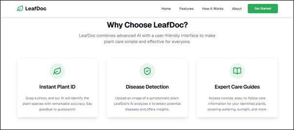
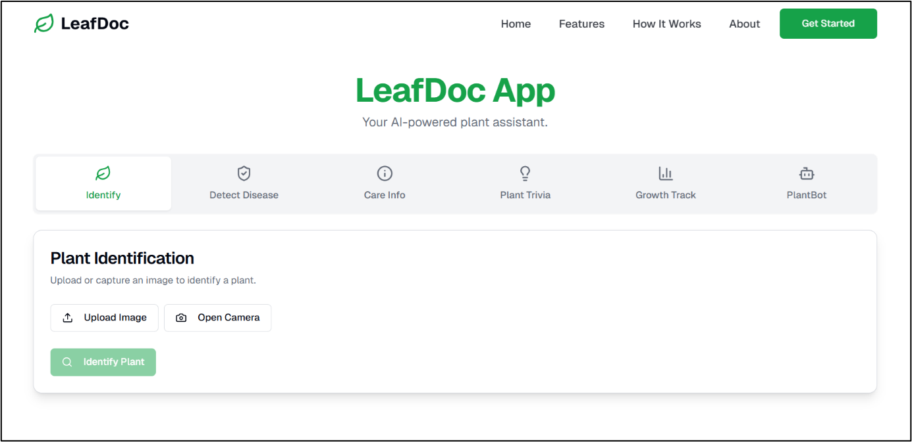
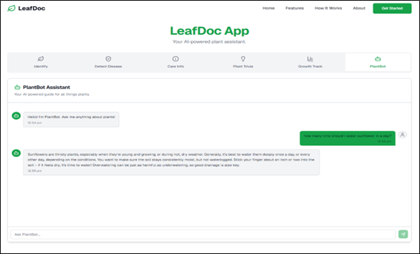

# 🌿 LeafDoc

**AI-powered plant identification and disease detection**

LeafDoc is a web application that helps users identify plants, detect plant diseases, and get practical care guidance. It also includes plant trivia, a growth tracker, and PlantBot, an AI chatbot for plant-related questions.


## Table of Contents

- [Features](#features)
- [Tech Stack](#tech-stack)
- [Architecture](#architecture)
- [Project Structure](#project-structure)
- [Getting Started](#getting-started)
- [Screenshots](#screenshots)
- [Documentation](#documentation)
- [Author](#author)
- [License](#license)

## Features

- **Plant identification:** Identify species from an uploaded image or a photo taken with your camera
- **Disease detection:** Analyze plant images and symptoms to find likely diseases and suggested treatments
- **Plant care guidance:** Sunlight, watering, soil, and temperature recommendations
- **Plant trivia:** Interesting facts about identified plants
- **Growth tracking:** Track plant progress with a milestone-based growth tracker
- **PlantBot:** AI chatbot for plant-related questions
- **Camera support:** Capture images directly from your device
- **Responsive design:** Works smoothly across screen sizes

## Tech Stack

| Category | Technologies |
|----------|--------------|
| Frontend | Next.js 15, React 18, TypeScript, Tailwind CSS, Framer Motion, Lucide React |
| AI | Genkit, Google Gemini 2.5 Flash-Lite |
| Libraries | Zod (validation), Radix UI |
| Tooling | npm |


## Architecture

LeafDoc uses a Next.js application structure with Genkit-based AI flows that call Google Gemini.

```text
User
  │
  ▼
LeafDoc Web Interface
  ├── Plant Identification
  ├── Disease Detection
  ├── Plant Care
  ├── Plant Trivia
  ├── Growth Tracking
  └── PlantBot
  │
  ▼
Next.js / React
  │
  ▼
Genkit AI Flows
  │
  ▼
Google Gemini
  │
  ▼
AI-generated plant insights
```

## Project Structure

```text
LeafDoc/
├── Documentation/
│   ├── LeafDoc Final.pdf
│   ├── LeafDoc Journal Paper.pdf
│   ├── LeafDoc Thesis.pdf
│   ├── MP Synopsis.pdf
│   ├── Research Paper.pdf
│   └── LeafDoc-A-Generative-AI-Based-Plant-Identification-and-Disease-Diagnosis-System.pptx
├── Leafdoc/
│   ├── docs/
│   │   └── blueprint.md
│   ├── src/
│   │   ├── ai/
│   │   │   ├── flows/
│   │   │   │   ├── detect-disease.ts
│   │   │   │   ├── identify-plant.ts
│   │   │   │   └── plant-chat-flow.ts
│   │   │   ├── ai-instance.ts
│   │   │   └── dev.ts
│   │   ├── app/
│   │   ├── components/
│   │   ├── hooks/
│   │   ├── lib/
│   │   └── services/
│   ├── .env.example
│   ├── package.json
│   ├── next.config.ts
│   └── tsconfig.json
├── Screenshots/
├── Test samples/
├── .gitignore
└── README.md
```

## Getting Started

### Prerequisites

- Node.js 18.18 or higher
- npm
- A Google Generative AI (Gemini) API key

### Installation

1. **Clone the repository**

```bash
   git clone https://github.com/Prayasit/LeafDoc.git
   cd LeafDoc/Leafdoc
```

2. **Install dependencies**

```bash
   npm install
```

3. **Configure environment variables**

   Copy `.env.example` to `.env` and add your key:

```env
   GOOGLE_GENAI_API_KEY=your_google_genai_api_key
```

4. **Start the development server**

```bash
   npm run dev
```

5. Open **http://localhost:9002** in your browser.

## Screenshots

| Home |
|------|
|  |

| Features |
|----------|
|  |

| Plant Identification |
|----------------------|
|  |

| Identification Result |
|-----------------------|
|  |

| Disease Detection |
|-------------------|
|  |

| Disease Detection Result |
|--------------------------|
|  |

| Care Information |
|------------------|
|  |

| Care Information Result |
|-------------------------|
|  |

| Plant Trivia |
|--------------|
|  |

| Growth Tracking |
|-----------------|
|  |

| PlantBot |
|----------|
|  |

| PlantBot Conversation |
|-----------------------|
|  |

## Documentation

| Document | Description |
|----------|-------------|
| [LeafDoc Final](Documentation/LeafDoc%20Final.pdf) | Final project documentation |
| [LeafDoc Thesis](Documentation/LeafDoc%20Thesis.pdf) | Detailed project thesis |
| [Journal Paper](Documentation/LeafDoc%20Journal%20Paper.pdf) | Research journal paper |
| [Research Paper](Documentation/Research%20Paper.pdf) | Research documentation |
| [MP Synopsis](Documentation/MP%20Synopsis.pdf) | Major project synopsis |
| [Project Presentation](Documentation/LeafDoc-A-Generative-AI-Based-Plant-Identification-and-Disease-Diagnosis-System.pptx) | Project presentation |

## Authors

- **Prayas Gotefode**, MCA Student
- **Shiwani Amrute**, MCA Student

- GitHub: [@Prayasit](https://github.com/Prayasit)
- LinkedIn: [Prayas Gotefode](https://www.linkedin.com/)

## License

Developed as an academic major project. The source code and documentation are provided for educational and portfolio purposes.

---

⭐ If you find this project useful, consider giving the repository a star!
